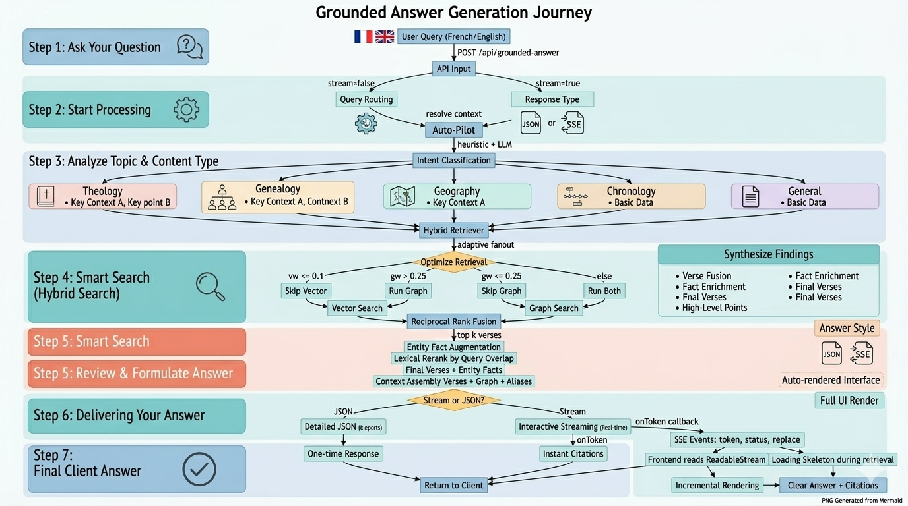

# Bible Chat Scholar

Bible Chat Scholar is a ~~proof-of-concept~~ Bible AI engine using semantic search (vector embeddings) and a roadmap toward RAG + knowledge graph capabilities.

## What it includes

- XML → JSON parsing pipeline
- Verse embedding/vectorization pipeline
- Semantic Search API in Next.js
- Foundation for hybrid retrieval (vector + graph)

## Architecture diagram

## Tech stack

- Next.js (App Router, TypeScript)
- DocumentDB / Mongo-compatible vector search
- OpenAI embeddings (`text-embedding-3-small`)
- LangChain

## Quick start

1. Install dependencies
2. Configure environment variables (`DATABASE_URL`, `OPENAI_API_KEY`, etc.)
3. Run app and pipelines as needed

## Documentation references

- [Docs folder](./docs)
- [Roadmap](./docs/roadmap.md)
- [User Story: US-003 Semantic Search API](./docs/user-stories/us-003-semantic-search-api.md)

## Licensing

- **Code**: [MIT License](`./LICENSE`)
- **Data**: [CC0-1.0](`./DATA_LICENSE.md`), source: https://github.com/christos-c/bible-corpus